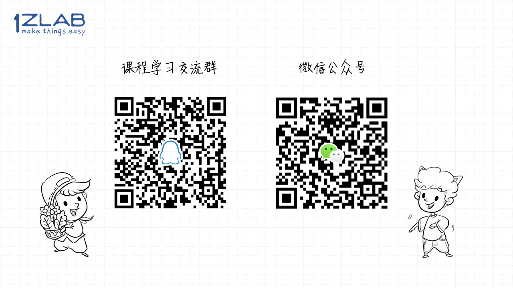

# MicroPython-ESP32固件烧录-1Z实验室


出品：**1Z实验室**

**1ZLAB: Make Things Easy**


## 导引

ESP32开发板只有烧录了MicroPython的固件，才能使用MicroPython进行编程。

在这篇文章里面，会讲解如何在Ubuntu下给ESP32开发板烧录MicroPython的固件。


## 下载最新固件

固件可以自己编译也可以下载最新固件.

固件下载地址： https://micropython.org/download/#esp32

## 安装pip或pip3
Ubuntu下默认自带Python的解释器`Python2.7`跟`Python3.5`，开发一般我们选择`Python3.5`

**注意，不要替换Ubuntu下的Python2.7跟Python3.5**
1. 不要把系统自带的`Python3.5`升级为`Python3.7`等更新的版本，除非是使用Anaconda这种管理工具。
2. 不要把`usr/bin`里面的`python`从`python2`替换成`python3`， 会导致系统运行一些功能的时候出现异常。使用Python3的时候尽量显示的去执行`python3 + xxxxx.py`

另外pip是python的包管理工具，默认系统是没有安装pip的。
`python2`的包管理工具对应的是`pip`， `Python3`的包管理工具对应的是`pip3`

**pip安装**
```bash
$ sudo apt-get install python-pip
```

**pip3安装**
```bash
$ sudo apt-get install python3-pip
```


## 安装固件烧录工具 ESPTOOL

**esptool在python2与python3均有发行版本，可以通过pip或pip3安装esptool， 在实际使用的时候并无区别。**


**pip (Python2) 安装esptool**

```bash
$ sudo pip install esptool --upgrade
```
或者是
**pip3 (Python3)安装esptool**

```bash
$ sudo pip3 install esptool --upgrade
```
ESPTOOL 的帮助文档见： https://github.com/espressif/esptool

>  注意：如果是anaconda  就不能通过`pip` 安装。 可以在`.bashrc`中， 先屏蔽掉anaconda ，然后安装pip


## 使用esptool进行固件烧录

将ESP32开发板与PC相连,  确定ESP32开发板在Ubuntu下分配的端口号 `ttyUSB?` 

```bash
$ ls -l /dev/ttyUSB* 
```
**OUTPUT**
```bash
crw-rw---- 1 root dialout 188, 0 8月  10 10:42 /dev/ttyUSB0
```

固件烧录脚本

```
$ sudo esptool.py --chip esp32 --port /dev/ttyUSB0 write_flash -z  0x1000 esp32-xxxxx固件版本号.bin 
```


固件烧录日志

```bash
$ sudo esptool.py --chip esp32 --port /dev/ttyUSB1 write_flash -z  0x1000 esp32-20180411-v1.9.3-534-g59dda710.bin 
esptool.py v2.3.1
Connecting........_
Chip is ESP32D0WDQ6 (revision 1)
Features: WiFi, BT, Dual Core
Uploading stub...
Running stub...
Stub running...
Configuring flash size...
Auto-detected Flash size: 4MB
Compressed 973584 bytes to 604211...
Wrote 973584 bytes (604211 compressed) at 0x00001000 in 53.5 seconds (effective 145.5 kbit/s)...
Hash of data verified.

Leaving...
Hard resetting via RTS pin...


```


## Reference参考资料


[Tutorial Getting started with MicroPython on ESP32-Hello World, GPIO, and WIFI](https://www.cnx-software.com/2017/10/16/esp32-micropython-tutorials/)


## 推广




