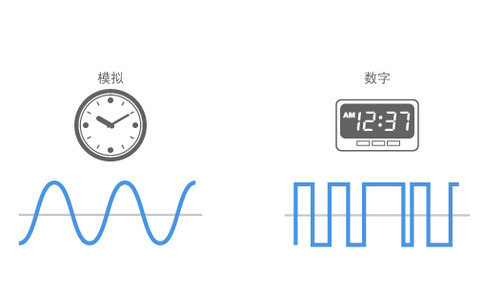

# GPIO控制小灯亮灭-1Z实验室


## 概要

数字信号与GPIO输出控制小灯亮灭。


## 数字信号

在计算机领域，信号分为两种，一种是模拟信号，一种是数字信号。



**模拟信号 Analog **是连续的值，可以取0-N之间任意的值。

**数字信号 Digital** 是离散的值，而且更局限的是它只有**0 （低电平）**跟 **1（高电平）** 两种状态。


对于单片机的数字引脚而言，只能输出高电平与低电平两种状态，如果用数字信号来控制LED小灯，0跟1可以控制小灯的亮灭两种状态。

| 电平     | 小灯   |
| -------- | ------ |
| 高电平 1 | 小灯亮 |
| 低电平 0 | 小灯灭 |


## Pin.OUT输出

我们在文章[用ESP32-MicroPython点亮一个LED-1Z实验室](https://www.jianshu.com/p/a25bc059ea1c) 中，讲解了如何给MicroPython写入代码，同时也提供了点亮一个LED的演示实例，这里我们再次回顾一下。


**PyESPCar小车底板 第13号引脚就是上拉的LED不需要外接,  高点平灭， 低电平亮。 使用的时候需要接入外接电源， 打开电源开关**

**NodeMCU32s开发板上的P2也是LED， 蓝色的， 高电平亮， 低电平灭。**


从`machine`模块里面，导入`Pin` 管脚这个类。

然后创建一个Pin的对象，括号里面传入这个管脚的GPIO编号，这里用的是13号引脚。

需要声明管脚的模式为输出模式`Pin.OUT`.

```python
from machine import Pin
# 创建一个Pin的对象，传入GPIO的编号
led_pin = Pin(13, Pin.OUT)
```

写入高低电平使用`value`函数。

```python
LED_ON = 0 # LED亮的时候的电平
LED_OFF = 1 # LED灭的时候的电平
# 小灯灭
led_pin.value(LED_OFF)
# 小灯亮
led_pin.value(LED_ON)
```

如果`value` 里面不传参数，返回的是引脚高低电平的状态。每次修改电平的高低的时候， Pin对象就会用一个变量来记录最近一次的写入的电平高低。

```python
led_pin.value()
```


如果你用的是NodeMCU32s上面自带的P2上面的LED的话，需要改为：

````python
LED_ON = 1 # LED亮的时候的电平
LED_OFF =0 # LED灭的时候的电平
````


> TODO 控制小灯的亮灭 esp32
>
> 与效果视频
>
> 首先定义为输出模式
>
> Pin.OUT


## 自定义LED类

> PS: 看懂这部分， 需要各位同学有Python面向对象相关的基础。
> 知识点关键词： 类， 面向对象， 方法， 构造器

接下来我们可以自定义一个LED类:

`src/led.py`
```python
from machine import Pin

class LED:
    def __init__(self, led_id):
        # LED字典 
        # 数据结构： (gpio管脚编号， LED灭的电平， LED亮的电平)
        led_list = [(2, False, True),(13, True, False)]

        if led_id >= len(led_list) or led_id < 0:
            print('ERROR：LED编号无效， 有效ID：{} - {}'.format(0, len(led_list-1)))
            return None
        
        gpio_id, self.LED_OFF, self.LED_ON = led_list[led_id]
        self.led_pin = Pin(gpio_id, Pin.OUT)
        
    def on(self):
        '''
        打开LED
        '''
        self.led_pin.value(self.LED_ON)
    
    def off(self):
        '''
        关闭LED
        '''
        self.led_pin.value(self.LED_OFF)
    
    def toggle(self):
        '''
        切换LED的状态
        OFF -> ON
        ON  -> OFF
        '''
        self.led_pin.value(not self.led_pin.value())
```

把板子上都有哪些LED资源，定义在 LED的 led_list里面
```python
# 数据结构： (gpio管脚编号， LED灭的电平， LED亮的电平)
led_list = [(2, False, True),(13, True, False)]
```

接下来你可以创建一个LED对象， 然后尝试不同的方法。

* led.on() 开启LED
* led.off() 关闭LED
* led.toggle() 切换LED的状态


`src/test_led.py`

```python
from led import LED
# 提示: 你也可以尝试LED(1)
# 创建一个LED对象
led = LED(0)

# 开启LED
led.on()

# 关闭LED
# led.off()

# 切换LED的状态
# led.toggle()
```
