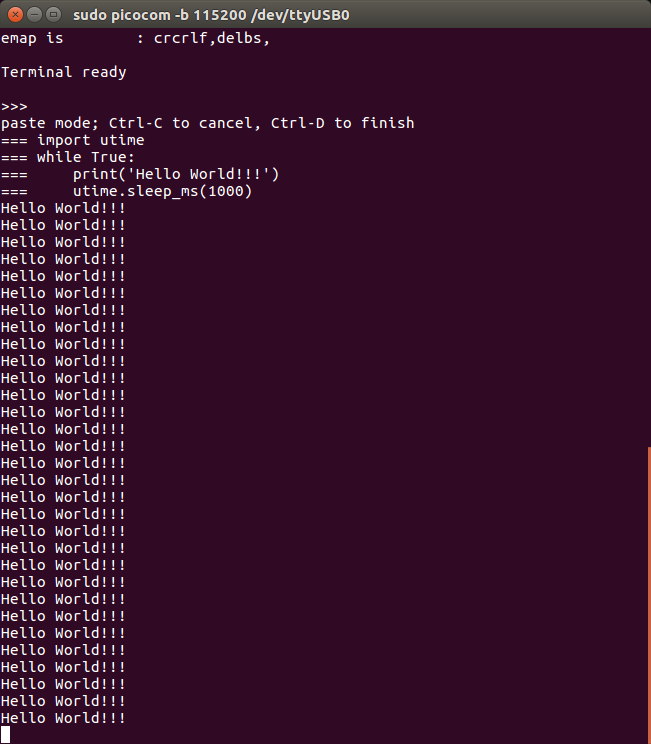

 

# 延时函数与LED闪烁


## 概要

实现LED闪烁首先需要学习延时模块，然后会给出控制LED闪烁的两套代码。


## 延时模块utime

在micropython-esp32固件中，系统延时需要用到`utime`模块。

`sleep_ms`函数的作用是延时N个毫秒。

```python
# 延时1000毫秒
utime.sleep_ms(1000)
```

**Hello World测试代码**

> 注解: HelloWorld是一个小白程序员入门的神圣仪式，HelloWorld向世界表达敬意与善意。 
>
> 硬件工程师的HelloWorld一般是点亮一个LED，而软件工程师的HelloWorld则是print('Hello World')


```python
'''
演示延时功能
每隔1s(1000 ms) 打印一个hello_world
'''
import utime
while True:
    print('Hello World!!!')
    utime.sleep_ms(1000)
```


**效果演示**




## 控制LED闪烁v1

控制LED闪烁的核心流程就是：

点亮LED --> 停顿一会儿 --> 关闭LED --> 停顿一会儿


> 注意： 这里需要我们在课程3 **GPIO输出控制小灯亮灭**里面创建的`led.py` , 
> 你需要将这个文件传入到ESP32文件系统里面。


```python
'''
功能介绍： LED闪烁例程

版本： v1
版本说明： 
    逐行控制高低电平与延迟
'''
import utime
from led import LED

# 声明一个LED对象 （P2）
led = LED(0)

while True:
    # 点亮LED
    led.on()
    # 延时 500ms
    utime.sleep_ms(500)
    # 关闭LED
    led.off()
    # 延时500ms
    utime.sleep_ms(500)
```


> 思考一下: 试试不添加第二个延时会怎么样？


> TODO 添加效果视频


## 控制LED闪烁v2

v2版本的代码是使用Python里面的`Function 函数` 来封装了一下LED闪烁的功能。


```python
'''
功能介绍： LED闪烁例程

版本 v2
版本说明： 利用函数实现led闪烁
'''
import utime
from led import LED

# 声明一个LED （P2）
led = LED(0)

def led_blink(led_pin, delay_ms=500):
    '''
    控制led的引脚（led_pin）进行闪烁 
    时间间隔为 delay_ms ， 默认为500ms
    '''
    global led
    led.toggle() # 切换LED的状态
    utime.sleep_ms(delay_ms) # 延时500ms

while True:
    led_blink(led_pin, delay_ms=500)
    # led_blink(led_pin, delay_ms=100)
```
你可以尝试不同的`delay_ms` 查看LED的闪烁效果。
