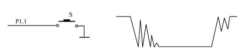

# GPIO输入与用户按键控制LED开关-1Z实验室


## 概要

* 读取按键的值 Value
* 按键状态打印
* 按键计数器
* 按键控制LED

## GPIO的输入模式

> 注： PyESPCar上自带用户按键，对应GPIO管脚编号为39。


从`machine` 里面导入`Pin`, 创建一个名字叫做`button`的管脚对象。
设置模式为输入模式（`Pin.IN`）. 
```python
from machine import Pin

# 用户按键GPIO
# PyESPCar上自带的用户按键在39号管脚
USER_BTN = 39
# 按键引脚对象
button = Pin(USER_BTN, Pin.IN)
```
读取电平高低的方式依然使用的是`value`函数。

```python
# 打印当前按键的电平 0 / 1
>>> button.value()
```

## 按键状态检测

这个时候，你可以尝试在按按钮的时候采集的电平，与不按按钮的时候电平。
常规的按键电路，按键按下电路导通，输入高电平，按键抬起输入低电平
在按键模块采用上拉电路的情况下，按键抬起是高电平，按下是低电平。

`BTN_DOWN`跟`BTN_UP`两个取值，可以根据你的按键模块做相应的调整。

`button_status.py`

```python
'''
打印按键的状态
'''
from machine import Pin
import utime

# 用户按键GPIO
# PyESPCar上自带的用户按键在39号管脚
USER_BTN = 39
# 按键引脚对象
button = Pin(USER_BTN, Pin.IN)

# 定义按键按下的值 （取决于按键模块的设计， 有可能相反）
BTN_DOWN = 0 # 按键按下对应的取值 
BTN_UP = 1 # 按键抬起对应的状态

while True:
    # 获取按钮状态
    btn_status = button.value()

    if btn_status == BTN_DOWN:
        print("按键状态：按下 <<<<<<<<")
    else:
        print("按键状态：抬起 ========")
    # 延时500ms
    utime.sleep_ms(100)

```

## 按键计数

按键计数就是记录按键按下的次数。
根据当前按键的状态`btn_status`与上一次按键的状态`last_btn_status`来判断按键是否按下。如果当前按键状态为`BTN_DOWN`，之前的按键状态为`BTN_UP` 则判断为产生一次键盘按下的事件，计数器`counter`就+1。

`button_counter.py`

```python
'''
[功能描述]
按键计数器 每按一下，数值加1
[存在问题]
存在按键抖动的问题
'''
from machine import Pin
import utime

# 引脚
button = Pin(22, Pin.IN)

# 定义按键按下的值 （取决于按键模块的设计， 有可能相反）
BTN_DOWN = 0 # 按键按下对应的取值 
BTN_UP = 1 # 按键抬起对应的状态

# 记录上一次按键的状态
last_btn_status = BTN_UP
counter = 0 # 计数器

print("按下按键， 会计数哦")
while True:
    # 获取按钮状态
    btn_status = button.value()

    if btn_status == BTN_DOWN and last_btn_status == BTN_UP:
        print("按键按下")
        counter += 1
        print("Counter += 1 ; Counter = %d"%(counter))

    last_btn_status = btn_status
    # 延时200ms 消抖用
    utime.sleep_ms(200)
```

## 按键抖动与消抖
在上面的演示实例运行的过程中，我们会发现有时候按下一次，计数器会增加好几个数值。这个是因为按键**抖动 Bouncing**的问题，当机械触点断开、闭合时，由于机械触点的弹性作用，一个按键开关在闭合时不会马上稳定地接通，在断开时也不会一下子断开。



从而产生噪声，干扰对按键状态的判断，为了克服这个问题，产生了**消抖**技术。

消抖又分为两种，一种是软件消抖，一种是硬件消抖。硬件消抖的方式就是在按键两端加上一个电容。

软件消抖又有延时消抖，定时轮巡，还有时间戳+状态机（适用于外部中断）的方法。

上面的按键计数中的：
```python
# 延时100ms 消抖用
utime.sleep_ms(200)
```
就是较为简单的延时消抖，延时时间短了效果不稳定，抖动还是比较明显。如果延时时间长了，一来反应速度慢，而来阻塞式延时，比较消耗资源。

软件消抖的算法，在后续的课程里再深入讲解，这里大家需要知道有这么一会儿事。

> TODO 编写软件消抖的教程。

## 按键控制LED亮灭

用按键来切换LED的状态，在0 - 1之间进行切换.

LED 就用NodeMCU32s上自带的2号引脚LED，

按键使用PyESPCar小车底板上的用户按键（39号引脚）

**注：需要我们在课程”PWM与呼吸灯“创建的led.py**

`src/button_ctrl_led.py`
```python
'''
按键控制LED亮灭
状态转换
'''
from machine import Pin
import utime
from led import LED
# 按键
# 用户按键GPIO
# PyESPCar上自带的用户按键在39号管脚
USER_BTN = 39
# 按键引脚对象
button = Pin(USER_BTN, Pin.IN)
# 创建一个LED对象
led = LED(0)


# 定义按键按下的值 （取决于按键模块的设计， 有可能相反）
BTN_DOWN = 0 # 按键按下对应的取值 
BTN_UP = 1 # 按键抬起对应的状态
last_btn_status = None

while True:
    # 获取按钮状态
    btn_status = button.value()

    if btn_status == BTN_DOWN and last_btn_status == BTN_UP:
        # 切换LED状态
        led.toggle()
        print("按键按下,LED状态转换 LED: {}".format(led.pin.value() == led.LED_ON))
        
    last_btn_status = btn_status
    # 延时500ms
    utime.sleep_ms(150)

```


## 总结

这里大家可以看到， 如果想检测用户按键有没有按下这个动作，需要不停的去在while True 循环里面检测这个事件，那么有没有更好更优雅的实现方式呢？

请看下节课： **IRQ外部中断与按键控制LED小灯**

