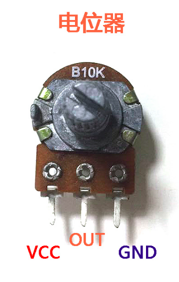

# ADC采样与电位计控制LED亮度


## ADC是什么

ADC的英文全称是Analog /  Digital Converter，中文是模拟数字转换器，ADC是单片机读取传感器信号的常见方式。

在**GPIO输出与控制LED亮灭**这一章里面，我们知道了数字信号与模拟信号之间的区别。 我们日常生活中的信号，例如光照强度，声波，电池电压 这些都是模拟值。 如果我们想通过单片机对模拟信号(电压，光照强度，声波)进行测量，用数字信号进行表达，这个时候我们就需要**ADC** 模拟数字信号转换器。 


## ADC的API文档


### 硬件资源


在ESP32里面ADC一共有两个，分为`ADC 1` 还有`ADC 2`， 其中又因为ESP32的`ADC2`不能与WIFI联网同时存在，当连接WIFI的时候`ADC 2`的管脚就不能进行ADC采样，所以**MicroPython-ESP32固件里面，并没有实现对`ADC 2`的支持，大家看引脚图的时候留意一下这个问题。**


ESP32的`32-39`管脚具备ADC功能：

| GPIO编号 | ADC编号 | 通道编号 |
| -------- | ------- | -------- |
| 36       | 1       | 0        |
| 37       | 1       | 1        |
| 38       | 1       | 2        |
| 39       | 1       | 3        |
| 32       | 1       | 4        |
| 33       | 1       | 5        |
| 34       | 1       | 6        |
| 35       | 1       | 7        |


### 实例化

从`machine`模块里面导入两个类 `Pin` 还有`ADC`

```python
from machine import Pin,ADC
```

第一步还是创建一个`Pin`的对象：

```python
adc_pin = Pin(34)
```

解下来创建一个ADC的对象，直接把pin对象传入到ADC的构造器里面。

```python
adc = ADC(adc_pin)
```


### 初始化ADC-设置衰减比

> TODO , 衰减器 还有 衰减电路这部分超出了我的理解范围， 欢迎硬件大神前来补充。


ADC采样有两个重要的参数，一个是**满量程电压**是多少，显然不可能超过ESP32的管脚电压**3.3v**. 可以设定0-3.3v之间的一个值。

| 宏定义         | 数值 | 满量程电压 |
| -------------- | ---- | ---------- |
| ADC.ATTN_0DB   | 0    | 1.2v       |
| ADC.ATTN_2_5DB | 1    | 1.5v       |
| ADC.ATTN_6DB   | 2    | 2.0v       |
| ADC.ATTN_11DB  | 3    | 3.3v       |


演示样例：

```python
adc.atten(ADC.ATTN_11DB)
```


### 初始化ADC-设置衰减比

然后就是用多少比特来表示数值，比特数(**数据宽度**)越大，能够表示的也就越精确，信息丢失的也就越好。

举个例子，如果数据宽度是10，那么ADC采样的取值范围就是` 0 - 1024`. 

1024 =  2^10 - 1 

| 宏定义          | 数值 | 数据宽度 |
| --------------- | ---- | -------- |
| ADC.WIDTH_9BIT  | 0    | 9        |
| ADC.WIDTH_10BIT | 1    | 10       |
| ADC.WIDTH_11BIT | 2    | 11       |
| ADC.WIDTH_12BIT | 3    | 12       |


### ADC采样(ADC.read)

使用`read`函数进行ADC采样

```python
adc.read()
```


## ADC采集电位计的数据

将电位计的OUT管脚与ESP32的34号引脚相连。


隔一段时间就取一次样， 打印到屏幕上面。

`adc_demo.py`
```python
from machine import ADC,Pin
import utime


# 设置D34号引脚作为ADC采样引脚
pin_read = Pin(34)
# 声明ADC对象
adc = ADC(pin_read)
# 设置衰减比 满量程3.3v
adc.atten(ADC.ATTN_11DB)
# 设置数据宽度为10bit
adc.width(ADC.WIDTH_10BIT)

while True:
    # 数据采样 数值范围0-1023
    value = adc.read()
    # 打印日志
    print("Value: %d"%value)
    # 延时500ms
    utime.sleep_ms(500)
```


## ADC采样均值滤波

检测ADC采样值是否发生变化，如果发生变化就打印出来， 采用均值滤波对噪声进行过滤。 
所谓均值滤波就是采集多组取一个平均值。

`adc_value_mean.py`
```python
from machine import ADC,Pin
import utime


# 设置D34号引脚作为ADC采样引脚
pin_read = Pin(34,Pin.IN)
# 声明ADC对象
adc = ADC(pin_read)
# 设置衰减比 满量程3.3v
adc.atten(ADC.ATTN_11DB)
# 设置数据宽度为10bit
adc.width(ADC.WIDTH_10BIT)

last_value = 0
sample_times = 10
while True:
    # 做一个简单的均值滤波
    value_sum = 0
    for i in range(sample_times):
        value_sum += adc.read()
    # 计算ADC采样的均值
    value_mean =  value_sum / sample_times
    # 判断是否发生了变化
    if abs(last_value-value_mean) > 2:
        # 打印日志
        print("电位计采样: %d"%value_mean)
    # 更新last value
    last_value = value_mean
    # 延时100ms
    utime.sleep_ms(100)
```


## 电位计控制LED亮度

注意： 代码片段太长，不能一次性粘贴到repl里面，需要分段粘贴。

`adc_ctl_led_light.py`

```python
'''
电位计采样，控制LED的亮度
[存在问题] 
不能CTRL+C中断， 需要reboot一下 ？

'''
from machine import ADC,Pin,PWM
import utime

# 12号引脚作为led引脚
led_pin = Pin(12, Pin.OUT)
led_pwm = PWM(led_pin)
led_pwm.duty(0)
led_pwm.freq(1000)

# 设置D34号引脚作为ADC采样引脚
pin_read = Pin(34,Pin.IN)
# 声明ADC对象
adc = ADC(pin_read)
# 设置衰减比 满量程3.3v
adc.atten(ADC.ATTN_11DB)
# 设置数据宽度为10bit
adc.width(ADC.WIDTH_10BIT)

def mean_filter(adc, sample_times = 10):
    # 做一个简单的均值滤波
    value_sum = 0
    for i in range(sample_times):
        value_sum += adc.read()
    # 计算ADC采样的均值
    value_mean =  value_sum / sample_times
    return value_mean

last_value = 0
while True:
    try:
        value_mean = mean_filter(adc)
        # 判断是否发生了变化
        if abs(last_value-value_mean) > 2:
            # 打印日志
            print("电位计采样: %d"%value_mean)
            # 根据adc采样 设定LED的duty
            # ADC采样与PWM占空比的范围都设定的是0-1023
            led_pwm.duty(int(value_mean))
        # 更新last value
        last_value = value_mean
        # 延时100ms
        utime.sleep_ms(100)
    except:
        # 释放PWM资源
        led_pwm.deinit()
```


## 思考题

如果我们想用ADC来测量航模电池的电压，而航模电池的电压远远大于ESP32工作电压，例如12v。 这个时候我们应该如何使用ADC对电池电压进行采样呢？

> 提示 ： 电阻分压


## PyESPCar电池电压测量


> TODO 有没有方法计算电池都还有多少电亮 100% ？ 使用时长是怎么计算出来的

> 