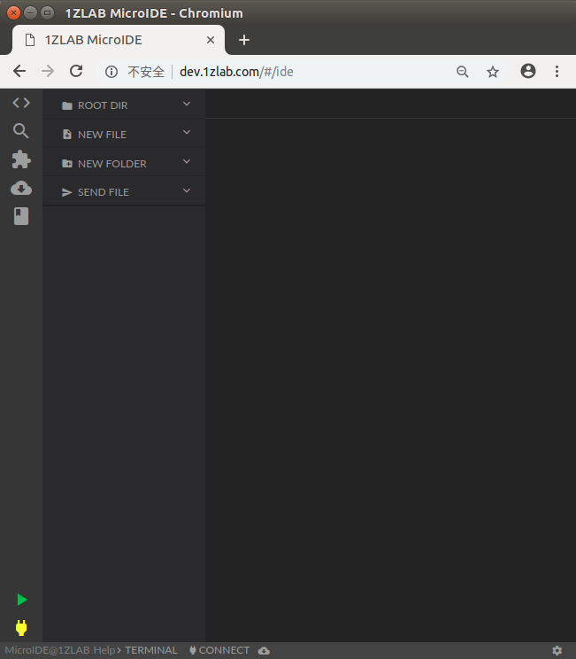
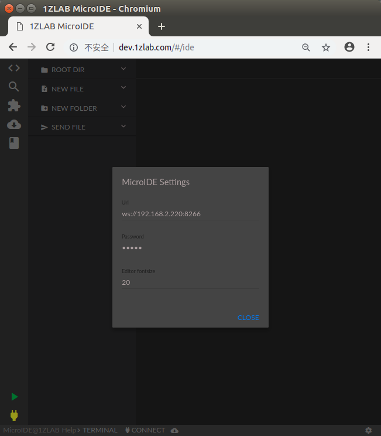
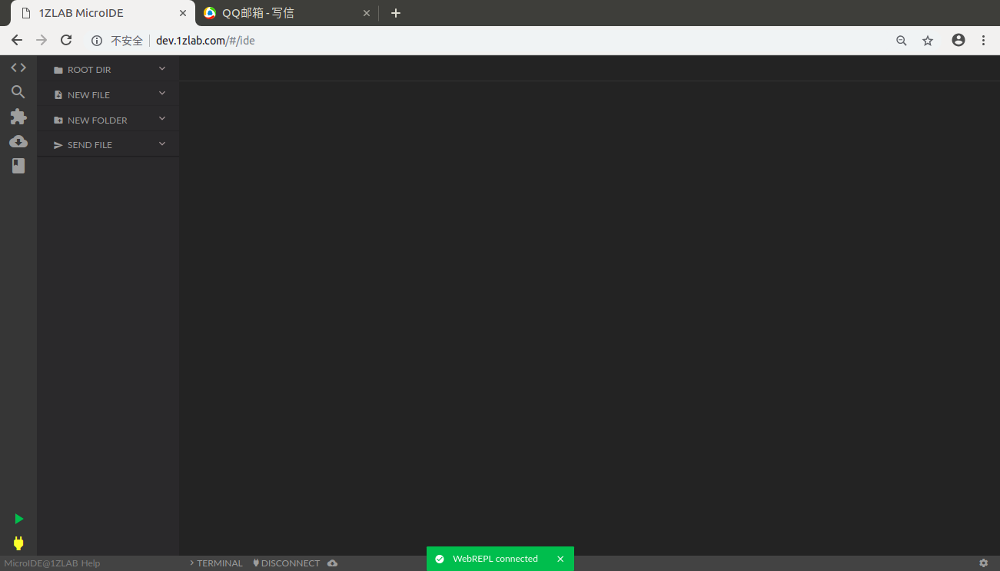
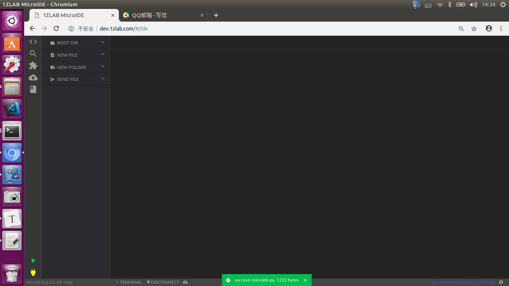
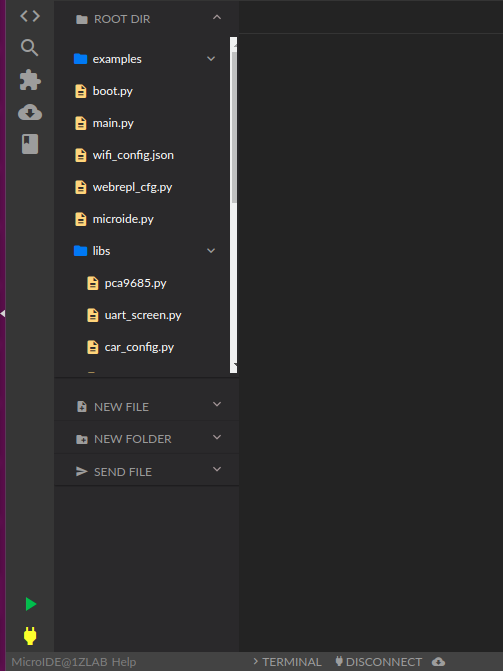
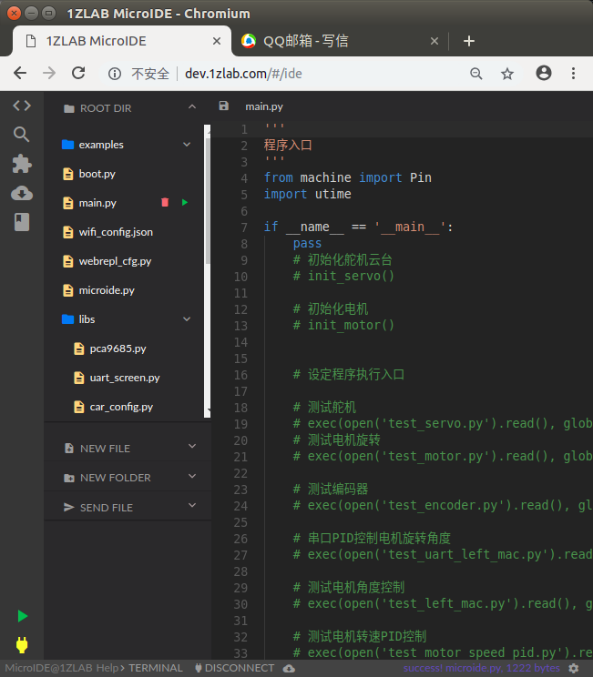
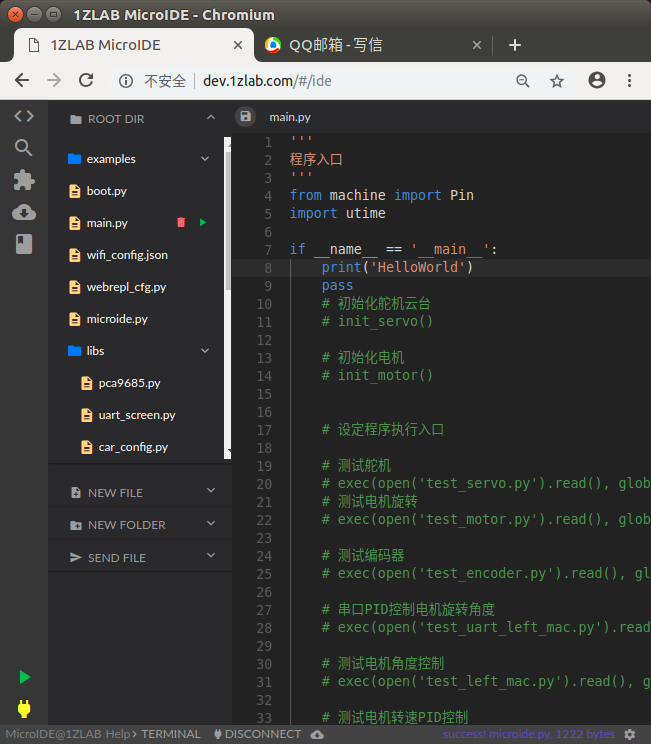
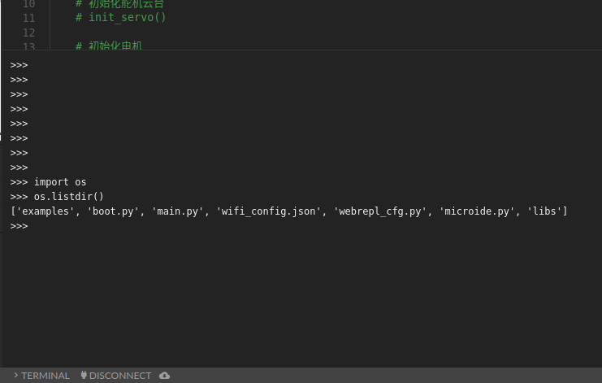
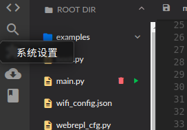
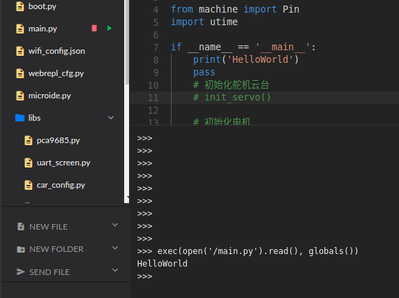

# WIFI热点连接与WebREPL配置教程-MicroPython-ESP32-1ZLAB出品

**1Z实验室出品**

**1ZLAB : make things easy**

1Z实验室 Make Things Easy . 致力于在机器人+计算机视觉+人工智能的重叠区域, 制作小白友好的教程.


## 概要

本文讲解了ESP32上电连接WIFI热点, 配置WebREPL还有如何使用1ZLAB出品的**[1ZLAB-MicroIDE](http://dev.1zlab.com)**


## 连接WIFI热点

在MicroPython里面, 代码的默认执行顺序是先执行`boot.py` 然后执行`main.py`. 

在`boot.py`里面写入WIFI连接的代码.  这段代码会使得每次上电重启的时候自动连接WIFI.

`boot.py` [源码链接](https://github.com/1zlab/1ZLAB_PyEspCar/blob/master/src/boot.py)

```python
import sys

# 添加路径
sys.path.append('examples')

def is_legal_wifi(essid, password):
    '''
    判断WIFI密码是否合法
    '''
    if len(essid) == 0 or len(password) == 0:
        return False
    return True

def do_connect():
    import json
    import network
    # 尝试读取配置文件wifi_confi.json,这里我们以json的方式来存储WIFI配置
    # wifi_config.json在根目录下
    
    # 若不是初次运行,则将文件中的内容读取并加载到字典变量 config
    try:
        with open('wifi_config.json','r') as f:
            config = json.loads(f.read())
    # 若初次运行,则将进入excpet,执行配置文件的创建        
    except:
        essid = ''
        password = ''

        while True:
            essid = input('wifi name:') # 输入essid
            password = input('wifi passwrod:') # 输入password

            if is_legal_wifi(essid, password):
                config = dict(essid=essid, password=password) # 创建字典
                with open('wifi_config.json','w') as f:
                    f.write(json.dumps(config)) # 将字典序列化为json字符串,存入wifi_config.json
                break
            else:
                print('ERROR, Please Input Right WIFI')
    
    #以下为正常的WIFI连接流程        
    wifi = network.WLAN(network.STA_IF)  
    if not wifi.isconnected(): 
        print('connecting to network...')
        wifi.active(True) 
        wifi.connect(config['essid'], config['password']) 
        import utime

        for i in range(200):
            print('第{}次尝试连接WIFI热点'.format(i))
            if wifi.isconnected():
                break
            utime.sleep_ms(100) #一般睡个5-10秒,应该绰绰有余
        
        if not wifi.isconnected():
            wifi.active(False) #关掉连接,免得repl死循环输出
            print('wifi connection error, please reconnect')
            import os
            # 连续输错essid和password会导致wifi_config.json不存在
            try:
                os.remove('wifi_config.json') # 删除配置文件
            except:
                pass
            do_connect() # 重新连接
        else:
            print('network config:', wifi.ifconfig()) 

if __name__ == '__main__':
    do_connect()
    import webrepl
    webrepl.start()
    from microide import *

```

使用AMPY将`boot.py`文件传到MicroPython-ESP32的文件系统里面.

> PS: 注意, 这个时候, ESP32已经通过USB线跟你的电脑相连接了.

```bash
sudo ampy --port /dev/ttyUSB0 put boot.py
```

文件传输成功之后, 使用**picocom**连接到MicroPython的REPL交互式终端.

> PS: 你可能需要改一下串口设备号

```bash
sudo picocom -b 115200 /dev/ttyUSB0
```

在连接上REPL之后, 会显示如下信息:

```bash
➜  PyEspCar git:(master) ✗ esp32-link 
picocom v1.7

port is        : /dev/ttyUSB0
flowcontrol    : none
baudrate is    : 115200
parity is      : none
databits are   : 8
escape is      : C-a
local echo is  : no
noinit is      : no
noreset is     : no
nolock is      : no
send_cmd is    : sz -vv
receive_cmd is : rz -vv
imap is        : 
omap is        : 
emap is        : crcrlf,delbs,

Terminal ready
>>> 
```

> PS: 如果你没有看到`>>>` 说明你需要中断当前在执行的程序, 使用`CTRL+C`快捷键.


接下来, 点击开发板上面的 **复位按键 RESET** 

> MicroUSB接口左边的那个
>
> TODO 添加实物图 
>
> 注意: 不是那个PyESPCar底板上面的大的用户按键.


当还没有进行WIFI连接的时候, 提示你输入**wifi name** (WIFI名称) 还有 **wifi passward** (WIFI密码).

```bash

>>> ets Jun  8 2016 00:22:57

rst:0x1 (POWERON_RESET),boot:0x17 (SPI_FAST_FLASH_BOOT)
configsip: 0, SPIWP:0xee
clk_drv:0x00,q_drv:0x00,d_drv:0x00,cs0_drv:0x00,hd_drv:0x00,wp_drv:0x00
mode:DIO, clock div:2
load:0x3fff0018,len:4
load:0x3fff001c,len:4596
load:0x40078000,len:0
load:0x40078000,len:12768
entry 0x4007ad68
I (387) cpu_start: Pro cpu up.
I (387) cpu_start: Single core mode
I (388) heap_init: Initializing. RAM available for dynamic allocation:
I (391) heap_init: At 3FFAE6E0 len 00001920 (6 KiB): DRAM
I (397) heap_init: At 3FFC57D0 len 0001A830 (106 KiB): DRAM
I (403) heap_init: At 3FFE0440 len 00003BC0 (14 KiB): D/IRAM
I (410) heap_init: At 3FFE4350 len 0001BCB0 (111 KiB): D/IRAM
I (416) heap_init: At 40091B28 len 0000E4D8 (57 KiB): IRAM
I (422) cpu_start: Pro cpu start user code
I (216) cpu_start: Starting scheduler on PRO CPU.
wifi name:ChinaNet-Q5uk
wifi passwrod:09223608237

```

接下来, ESP32会在一段时间内一直尝试连接WIFI热点. 根据当前WIFI的网络状况, 可能会多次重连.

```bash
第0次尝试连接WIFI热点
第1次尝试连接WIFI热点
第2次尝试连接WIFI热点
I (51541) wifi: n:2 0, o:1 0, ap:255 255, sta:2 0, prof:1
I (52101) wifi: state: init -> auth (b0)
I (52101) wifi: state: auth -> assoc (0)
I (52111) wifi: state: assoc -> run (10)
第3次尝试连接WIFI热点
第4次尝试连接WIFI热点
第5次尝试连接WIFI热点
I (52361) wifi: connected with ChinaNet-Q5uk, channel 2
I (52371) wifi: pm start, type: 1

I (52371) network: CONNECTED
第6次尝试连接WIFI热点
第7次尝试连接WIFI热点
第8次尝试连接WIFI热点
第9次尝试连接WIFI热点
第10次尝试连接WIFI热点
第11次尝试连接WIFI热点
第12次尝试连接WIFI热点
第13次尝试连接WIFI热点
第14次尝试连接WIFI热点

```

连接成功之后就会打印当前的网络信息

**sta ip** `192.168.2.220` ESP32设备在局域网下的IP, 你的可能是其他的`192.168.xxx.xxx` , 一般来讲,这个IP地址是路由器分配给这个设备的, 当这个设备下次重新连接路由器的时候 , 正常情况下还是这个IP, 所以你需要把这个IP地址记录一下. 

**mask** `255.255.255.0` 是子网掩码

**gw** `192.168.2.1` 是网关, 也就是路由器自己的IP地址


```
I (53281) event: sta ip: 192.168.2.220, mask: 255.255.255.0, gw: 192.168.2.1
I (53281) network: GOT_IP
第15次尝试连接WIFI热点
network config: ('192.168.2.220', '255.255.255.0', '192.168.2.1', '192.168.2.1')
```


然后你可以查看一下文件列表, 发现多出来一个名字叫做`wifi_config.json`的文件

```python
>>> import os
>>> os.listdir()
['examples', 'boot.py', 'main.py', 'wifi_config.json', 'libs']

```

查看一下它里面的内容

```python
with open('wifi_config.json') as f:
    print(f.read())
```

输出如下

```
'{"password": "092xx08xx7", "essid": "ChinaNet-Q5uk"}'
```


如果你想更换热点， 可以删除这个配置文件，然后reboot

```python
import os
os.remove('wifi_config.json')
```


## WebREPL配置

**注意， 只有新版的MicroPython-ESP32 才支持WebREPL， 请给ESP32烧录最新版的固件。**


然后它会提示你

```
I (53371) modsocket: Initializing
WebREPL is not configured, run 'import webrepl_setup'
```

**webrepl是个啥?**

webrepl可以让你在Web上面, 可以像串口的REPL那样, 交互式而且是远程的给ESP32编程, 底层原理是基于Websocket通信.  另外还需要借助一个Web IDE, 这里可以尝试1ZLab推出的 [1ZLAB-MicroIDE](http://dev.1zlab.com)


在webrepl使用之前, 需要初始化配置:

在REPL里面输入指令, 导入`webrepl_setup`这个包.

```python
import webrepl_setup
```


一开始问你, 是不是在boot的时候允许webrepl的运行.

输入字母`E`, 表示同意执行.

```
Would you like to (E)nable or (D)isable it running on boot?
(Empty line to quit)
> E
```

接下来, 需要你设置一个WebREPL的密码, 这里我设置的密码是`1zlab`. 

```
New password (4-9 chars): 1zlab
Confirm password: 1zlab
```

**webrepl的配置就ok了**

配置好了之后会在目录里面添加一个名字叫做`webrepl_cfg.py` 的文件.

同样, 你也可以查看`webrepl_cfg.py`里面的内容.

```python
with open('webrepl_cfg.py') as f:
    print(f.read())
```

输出结果:

```
PASS = '1zlab'
```


webrepl服务开启, 默认使用的是**8266** 端口.


## 1Z WebIDE 使用教程

如果想使用WebREPL, 还得借助一个WebIDE来完成这个事情.  [1ZLAB-MicroIDE : dev.1zlab.com](http://dev.1zlab.com) 实验室推出的这个IDE就是来完成这件事情的.

首先要确认, 当前PC上面连的热点与ESP32连接的热点是否为同一个. 然后尽量关闭各种网络代理， 因为会影响速度。 

**路由器性能与当前网速会影响整个WebIDE的体验。如果出现ESP32远程连接不上的情况， 可以检查网络是否通畅**


接下来在浏览器中输入网址`http://dev.1zlab.com` 进入MicroIDE的操作界面.


### 操作界面介绍



下方有四个按钮.

* `Terminal` 显示终端
* `Connect`  连接
* 下载(云朵标识)`microide.py` 文件到ESP32
* `设置按钮` 点击设置按钮可以编辑IP+端口号还有WebREPL的密码


### 配置WebREPL


第一步点击设置按钮, 在URL一栏里面填入当前ESP32在局域网下的IP还有端口号

```
ws://IP地址: 端口号
```

另外也填入之前设置的WebREPL的密码.




### 连接WebREPL

接下来点击`CONNECT` 连接按钮, 如果成功了, 就会在下方显示`WebREPL Connected` 连接成功的通知.




### 传输microide.py文件

接下来,如果你是**第一次使用MicroIDE** , 需要点击下方工具栏的云朵标识, 将`microide.py` 传到ESP32里面。

我们在`microide.py` 里面集成了很多内嵌的与IDE交互的功能， 需要搭配这个文件，才能正常使用。

如果文件传输成功了会提示：

```
success! microide.py! 1222bytes 
```

 




### 查看文件目录

完成了上述操作之后， 你就可以在文件侧边栏浏览当前ESP32的文件目录。

点击`ROOT DIR`， 查看完成目录结构。



### 编辑并保存文件

点击文件名称， 就可以查看并编辑`.py`文件。




我们可以编辑文件， 然后点击左上角的**保存按钮**， 就可以将文件同步到ESP32的文件系统里面。




同样， 如果下方出现绿色的提示框， 代表文件上传成功。


### 执行特定的文件

点击下方工具栏的**Terminal**按钮， 显示终端。 你需要根据你显示器的尺寸， 拖动Terminal边缘， 调整Terminal的尺寸。

> 因为有时候，容易隐藏在工具栏下， 所以需要重新调整大小。



我们之前编辑了`main.py` , 想要执行查看结果， 就点击文件目录上面的绿色的按钮， 代表执行。



点击完成后， 就会发现终端打印出来了

```
>>> exec(open('/main.py').read(), globals())                                                        
HelloWorld  
```

首先`exec`函数是执行这个`main.py`文件。

`HelloWorld`是执行`main.py` 所打印出来的结果。




尽情享受，可以远程控制ESP32的快感吧。


## 关于1Z实验室

出品：1Z实验室 （1ZLAB： Make Things Easy）

1Z实验室 Make Things Easy . 致力于在机器人+计算机视觉+人工智能的重叠区域, 制作小白友好的教程.

