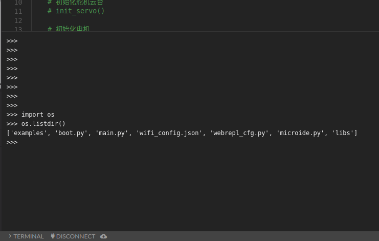

# WebREPL与MicroIDE配置教程-1Z实验室


## 概要

本文讲解了ESP32上电连接WIFI热点, 配置WebREPL还有如何使用1ZLAB出品的**[1ZLAB-MicroIDE](http://www.1zlab.com/ide)**

## 推广

**1Z实验室出品**

**1ZLAB : make things easy**

1Z实验室 Make Things Easy . 致力于在机器人+计算机视觉+人工智能的重叠区域, 制作小白友好的教程.


## ESP32连接WIFI热点

见教程: **ESP32接入WIFI热点**


## emp-1zlab的安装与配置

见教程： **使用upip安装包**, 教程里面就是以安装`emp-1zlab`包为例子讲解的。

```python
>>> import upip
>>> upip.install('emp-1zlab')
```


导入`emp_boot` 设置启动模式

```python
>>> import emp_boot
```

设置boot.py的启动模式 **这个操作会修改并覆盖boot.py文件**

```python
>>> emp_boot.set_boot_mode()
```


输入数字0-2

| boot mode 启动模式 | 备注                                                   |
| ------------------ | ------------------------------------------------------ |
| 0                  | boot.py里面啥也不做                                    |
| 1                  | 启动连接wifi热点                                       |
| 2                  | 开启开发模式， 启动连接WIFI热点，并开启webrepl开发模式 |

**这里我们选择2**


接下里代码会扫描周边的热点，找出可用热点列表。


Which one do you want to access? [0-16] 你想连接到哪个热点？从0-16中间选一个

这里我填入了`0` ， 选择这个名字叫做`zr` 的热点。

Passward for zr:  输入zr热点的密码, 填入密码`zrbengbeng` 

> ps: zr是阿凯的女朋友
>
> bengbeng是阿凯家的兔子。。。
>
> **有时候还是自己的手机wifi热点更稳定一些， 尤其是对在学校的同学们来说。**


* **注意： 上方红色的`IP: 192.168.43.168` 就是ESP32在当前局域网下的IP地址。**
* **注意： 上方红色的`IP: 192.168.43.168` 就是ESP32在当前局域网下的IP地址。**
* **注意： 上方红色的`IP: 192.168.43.168` 就是ESP32在当前局域网下的IP地址。**

你的应该不是这个IP， 而且，`一般情况下`，路由器给当前这个ESP32设备分配的IP地址不会变。

这样就说明wifi就配置成功了， 下次按`RST`重启ESP32的时候，也会自动重连WIFI热点了。


## WebREPL简介

**webrepl是个啥?**

webrepl可以让你在Web上面, 可以像串口的REPL那样, 交互式而且是远程的给ESP32编程, 底层原理是基于Websocket通信.  另外还需要借助一个Web IDE, 这里可以尝试1ZLab推出的 [1ZLAB-MicroIDE](http://www.1zlab.com/dev)

**注意， 只有新版的MicroPython-ESP32 才支持WebREPL， 请给ESP32烧录最新版的固件。**


## 设置WebREPL

接下来问题是否开启WebREPL模式， 输入`E`。 


初次设置的时候， 它会提示你输入WebREPL的密码：


这里我设置的密码是`1zlab`. 

```
New password (4-9 chars): 1zlab
Confirm password: 1zlab
```

**webrepl的配置就ok了**

配置好了之后会在 **ESP32的主目录** 里面添加一个名字叫做`webrepl_cfg.py` 的文件.

同样, 你也可以查看`webrepl_cfg.py`里面的内容.

```python
with open('webrepl_cfg.py') as f:
    print(f.read())
```
输出结果:

```
PASS = '1zlab'
```


执行上面的脚本需要使用REPL的Paste模式，这里重复一下： 

然后在picocom的REPL里面按`CTRL+E`进入粘贴模式， 右键粘贴刚才的代码片段。

**注意：粘贴好代码后，不要尝试修改粘贴好的代码，或者追加**

```python
>>> 
paste mode; Ctrl-C to cancel, Ctrl-D to finish
=== 
```

然后中端会提示你`Ctrl + C` 撤销刚才粘贴的代码， 就当啥也没发生过。

你可以按`Ctrl+D` 执行你刚才粘贴的代码。


**注意1： webrepl服务开启, 默认使用的是 `8266` 端口。**
**注意2： WebREPL服务需要重启生效，按ESP32开发板上的`RST`按钮。**


## 1Z WebIDE 使用教程

如果想使用WebREPL, 还得借助一个WebIDE来完成这个事情.  [1ZLAB-MicroIDE : dev.1zlab.com](http://dev.1zlab.com) 实验室推出的这个IDE就是来完成这件事情的.

首先要确认, 当前PC上面连的热点与ESP32连接的热点是否为同一个. 然后尽量关闭各种网络代理， 因为会影响速度。 

**路由器性能与当前网速会影响整个WebIDE的体验。如果出现ESP32远程连接不上的情况， 可以检查网络是否通畅**


接下来在浏览器中输入网址`http://dev.1zlab.com` 进入MicroIDE的操作界面.


### 操作界面介绍


下方有四个按钮.

* `Terminal` 显示终端
* `Connect`  连接
* 下载(云朵标识)`microide.py` 文件到ESP32
* `设置按钮` 点击设置按钮可以编辑IP+端口号还有WebREPL的密码


### 配置WebREPL


第一步点击设置按钮, 在URL一栏里面填入当前ESP32在局域网下的IP还有端口号

```
ws://IP地址: 端口号
```

另外也填入之前设置的WebREPL的密码.


### 连接WebREPL

接下来点击`CONNECT` 连接按钮, 如果成功了, 就会在下方显示`WebREPL Connected` 连接成功的通知.


连接不上，或者意外断开，尝试重新开启WebREPL。
**注意1： WebREPL服务需要重启生效，按ESP32开发板上的`RST`按钮。**
**注意2： 查看当前的WIFI信号是否通畅，另外最好关闭各种网络代理软件，例如lantern**
**注意3： 内存溢出，也是导致连接断开的原因之一。**

通过`gc`模块，可以释放资源，查看当前剩余的内存。
在使用的时候`import gc`模块， gc的英文全称是`garbage collection`
```python
>>> import gc
```
**查看当前内存还有多少剩余空间**：
```python
>>> gc.mem_free()
56048
```
这里返回的数值单位是`bytes`， 
```
1 KB = 1024 bytes
1 MB = 1024 KB 
```
所以`56048 bytes` = `0.053 MB`

**收集垃圾**使用`gc.collect()`
```python
>>> gc.collect()
```
收集玩垃圾之后，你可以看到剩余的内存就变多了。
```python
>>> gc.mem_free()
80976
>>> 
```

### 查看文件目录

完成了上述操作之后， 你就可以在文件侧边栏浏览当前ESP32的文件目录。

点击`ROOT DIR`， 查看完成目录结构。


### 编辑并保存文件

点击文件名称， 就可以查看并编辑`.py`文件。


我们可以编辑文件， 然后点击左上角的**保存按钮**， 就可以将文件同步到ESP32的文件系统里面。


同样， 如果下方出现绿色的提示框， 代表文件上传成功。


### 执行特定的文件

点击下方工具栏的**Terminal**按钮， 显示终端。 你需要根据你显示器的尺寸， 拖动Terminal边缘， 调整Terminal的尺寸。

> 因为有时候，容易隐藏在工具栏下， 所以需要重新调整大小。



我们之前编辑了`main.py` , 想要执行查看结果， 就点击文件目录上面的绿色的按钮， 代表执行。


点击完成后， 就会发现终端打印出来了

```
>>> exec(open('/main.py').read(), globals())                                                        
HelloWorld  
```

首先`exec`函数是执行这个`main.py`文件。

`HelloWorld`是执行`main.py` 所打印出来的结果。


尽情享受，可以远程控制ESP32的快感吧。


## 关于1Z实验室

出品：1Z实验室 （1ZLAB： Make Things Easy）

1Z实验室 Make Things Easy . 致力于在机器人+计算机视觉+人工智能的重叠区域, 制作小白友好的教程.

