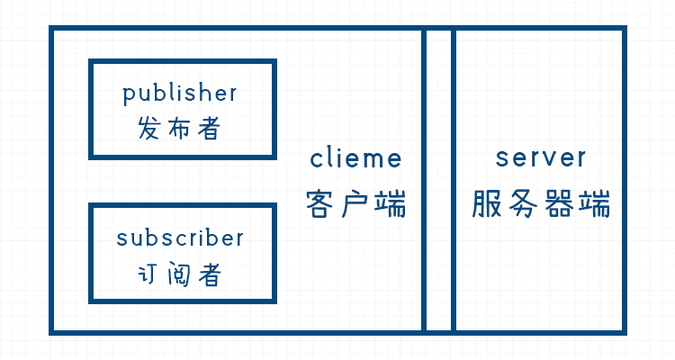

# MQTT入门之概念解析-MicroPython-ESP32-1Z实验室

## 概要

本节课讲了MQTT协议的特性， MQTT网络里面的组成部分，以及MQTT通信数据传输的流程讲解。

## 推广

**1Z实验室出品**
**1zlab: make things easy** 致力于在机器人+计算机视觉+人工智能的重叠区域, 制作小白友好的教程.

## MQTT协议简介

ESP32是一款**物联网(IOT, internet of things)**模块.  所谓物联就是机器与机器之间的通信， 互联互通之后，设备之间就可以协同工作。 ESP32作为一个单片机，其网络环境可能是不可靠的， 如果我们采用原始的socket通信，并不能保障信息可以到达接收方，数据的可靠性包括实时性都会有一定的影响， 所以这个时候就需要一种**网络通信协议Protocal** 来保障信息的传递， 保障**服务质量(Qos: Quality of Service**)。

互联网的基础网络协议是 TCP/IP。**MQTT（消息队列遥测传输）** 是基于 **TCP/IP 协议栈**而构建的，已成为 **IoT 通信的标准**。

> MQTT 是一种**轻量级**的,  **灵活**的网络协议，致力于为 IoT 开发人员实现适当的平衡： 
> - 这个轻量级协议可在严重受限的设备硬件和高延迟/带宽有限的网络上实现。 
>
> - 它的灵活性使得为 IoT 设备和服务的多样化应用场景提供支持成为可能。 

熟悉Web开发的同学，可能会有想法用Http协议来开发物联网应用， 为什么要用MQTT而不是HTTP，可以参考IBM的这篇文章， 讲的比较详细：[初识 MQTT-IBM](https://www.ibm.com/developerworks/cn/iot/iot-mqtt-why-good-for-iot/index.html) 。

总结下来MQTT有如下特性/优势：

- **异步消息协议**
- **面向长连接**
- **双向数据传输**
- **协议轻量级** 
- **被动数据获取**

## MQTT的发布和订阅模型

> 注: 图片来自REF 4

在基于MQTT协议的IOT网络里面里面有这么几个角色：

* **发布者 Publisher**  负责发布消息， 例如传感器采集数据，然后发送当前传感器的信息
* **订阅者 Subscriber** 订阅消息，根据获得的传感器数据做出对应的动作。
* **服务器 Server ** 信息的中转站，负责将信息从发布者传递到订阅者。

其中发布者与订阅者统称为**客户端 Client** 。

> 注: 图片来自REF 4

**注意， 这个划分并不是说三个角色必须是不同的实体设备，这里只是根据功能划分。**有时候一个设备可以同时为发布者跟订阅者， 就连服务器自己也可以作为客户端。

注意MQTT是协议，基于TCP/IP协议的**协议**, MQTT协议在客户端的实现称之为**MQTT Client**,

MQTT客户端的各种实现见： [mqtt/libs](https://github.com/mqtt/mqtt.github.io/wiki/libraries)

MQTT协议在服务器端的实现称之为**MQTT Broker**.   MQTT Broker基于各种语言（JAVA， C/C++）的实现，比较流行的MQTT Broker列表见：[mqtt server/brokers](https://github.com/mqtt/mqtt.github.io/wikiservers)

为什么MQTT会被广泛用于IOT开发？主要还是归功于它的发布者与订阅者的设计思想。

一个核心思想是，**能力越大， 责任越大** . 

我们拿PC与单片机举例子，从价格上还有硬件的操控能力，传感器数据读取方面， 单片机更合适， 如果一个地方需要采集100个位点的温度信息，可能会选择使用单片机来读取，那这么多的单片机之间如何进行通信呢？

单片机硬件资源有限(内存，带宽)， 就决定了单片机很难与多个客户端进行通信，同时与多个客户端建立长连接。 从内存占用，通信时延， 还有数据的稳定性上来讲，显然我们更相信PC在网络吞吐方面的能力。  另外PC还可以对数据进行数据预处理，然后作为Client发布处理后的数据。

所以根据各自能力的特点， 我们做如下职责划分：

每个单片机(Client)仅与PC（Server）保持一个**长连接**, 有什么数据就告诉**Server**,  如果有其他单片机或者PC跟这个单片机通信， 也只能通过这个**Server**来获取， 同时也要注意，这个数据获取的过程是**被动的**， 单片机没有主动每隔多少ms就去自动请求， 整个过程是**异步的**， 数据传过来，自动调用**回调函数**， 所以Server就成了这个单片机与这个周边设备通信的唯一的渠道，这个机制使得整个过程更加轻量级与高效 。 

> 图片来自与网络，侵权删

有点像一个地下组织的老大带领着一帮小弟的感觉， 小弟之间互不联系， 直接向老大传递信息， 老大像小弟传递指令。

通信所用的**数据帧 Data Frame**主要由**主题编号 Topic ID** 还有**信息 Message** 两部分组成。

**发布者与订阅者之间是没办法直接感知到对方的存在的**， 订阅者与发布者之间通过**数据帧 Data Frame** 里面的**主题编号Topic ID** 来获取自己想要的数据。

## MQTT通信流程详细描述

举一个远程控制LED灯亮灭的实际例子， 我们这里梳理一下过程。

ESP32与PC连入同一个局域网下， 获取PC 的IP地址

PC开启 MQTT Broker， 开启Server模式

ESP32传入PC的IP地址还有端口号，创建一个MQTT_Client

ESP32的MQTT_Client与PC上的MQTT_Server创建一个长连接

ESP32的MQTT_Client 订阅Topic **LED_CONTROL**

PC上创建一个CLIENT， Client里面传入本地IP与MQTT Broker服务的端口号， 与PC上面的Server建立一个长连接

PC上的Client， 发送数据帧  Topic ID + 指令， Topic ID为**LED Control**

数据帧： TOPIC_ID: **LED_CONTROL**,  MESSAGE: **LED_ON**

数据发送给Server， Server发现ESP32开发板订阅了**LED_CONTROL** 这个主题， 然后就通过ESP32与Server创建的连接发送该数据帧。

ESP32接收到这个数据帧，发现TOPIC_ID: **LED_CONTROL**, 于是知道这个是跟LED控制相关的指令。

读取到MESSAGE是**LED_ON**， ESP32执行指令`led.on()` , LED打开。

读完这篇文章，相信你对MQTT已经跃跃欲试了，下一节课，阿凯带你在局域网下用Python实现MQTT通信。见课程： **MQTT入门之项目实战**

## Reference

1. [mqtt.github.io](mqtt.github.io)

2. [MQTT协议中文版-Gitbook](https://mcxiaoke.gitbooks.io/mqtt-cn/content/mqtt/01-Introduction.html)

3. [初识 MQTT-IBM](https://www.ibm.com/developerworks/cn/iot/iot-mqtt-why-good-for-iot/index.html)

4. [raspberry-pi-esp32-micropython-mqtt-dht22-tutorial](https://www.rototron.info/raspberry-pi-esp32-micropython-mqtt-dht22-tutorial/)

   

## 推广

出品：1Z实验室 （1ZLAB： Make Things Easy）
1Z实验室 Make Things Easy . 致力于在机器人+计算机视觉+人工智能的重叠区域, 制作小白友好的教程.
