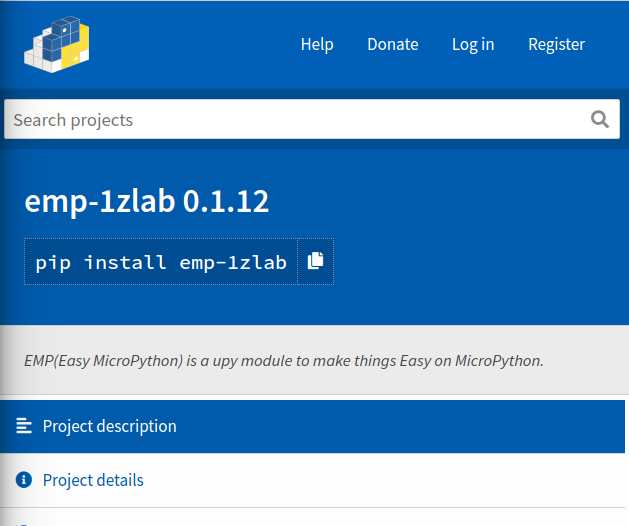
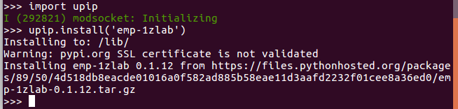

# 使用upip安装包


## 关于upip

upip类似标准Python中的pip包管理工具，你可以通过`upip`安装micropython中的库。

**注意 ， micropython的库与python的官方库都是托管在pypi平台上的， upip只不过是pip在micropython中的实现。**

你可以安装你需要的包， 这里我们以安装**emp-1zlab** 库为例来讲解

https://pypi.org/project/emp-1zlab/



> 注： emp-1zlab是1Z实验室出品的一个库，与我们的IDE一同使用  [1zlab.com/ide](http:1zlab.com/ide)


## ESP32连接WIFI热点

首先确定你**已经连接上了WIFI**， 连接上WIFI就可以跟外网打通， 可以请求远程的资源。

请见目录里面的 **ESP32接入WIFI热点** 这一章。


## 使用upip安装包

首先导入upip模块

```python
>>> import upip
```

然后执行安装指令：

```python
>>> upip.install('emp-1zlab')
```

`emp-1zlab` 就是我们要安装的包名。




## 使用upip更新包

在upip没有update方法，`install` 就相当于更新，会覆盖原有的。


## 关于安装路径

`upip` 的安装路径是`micropython`主目录下的`lib`文件夹。

```python
>>> upip.get_install_path()
'/lib'
```

可以使用`os.listdir` 查看当前你安装好的包。
使用前需要先引入**os**模块， 引入模块使用`import`语法。

```python
>>> import os
>>> os.listdir('lib')
['emp_boot.py', 'emp_dev.py', 'emp_utils.py', 'emp_wifi.py', 'umqtt', 'mqtt']
```

安装了`emp-1zlab` 自动下载了三个文件夹到ESP32的`./lib`文件夹下:

* `emp_boot.py`
* `emp_dev.py`
* `emp_utils.py`

