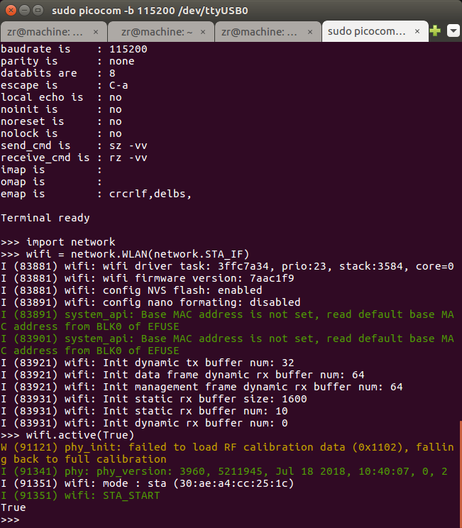
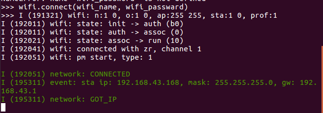

# ESP32接入WIFI热点


先确定你**已经连接上了WIFI**， 连接上WIFI就可以跟外网打通， 可以请求远程的资源。

连接上micropython-esp32的repl：

```bash
sudo picocom -b 115200 /dev/ttyUSB0
```

然后依次输入如下指令。

导入`network`的库

```python
>>> import network
```

设置WIFI为`STA`模式， 即接入热点

```python
>>> wifi = network.WLAN(network.STA_IF) 
```

激活WIFI

```python
>>> wifi.active(True) 
```




声明自己的WIFI名称还有密码， **改成你自己的哦！！**

```python
>>> wifi_name = 'myhome'
>>> wifi_password = '66666666'
```

连接WIFI

```python
>>> wifi.connect(wifi_name, wifi_password)
```

接下来，你可以看到如下日志




```
# 至此,可能你需要回车一下,才能出现下一 提示符 >>>
>>>
```

如果看到这条信息`I (63515) network: CONNECTED` 就代表你的WIFI已经连接成功了。
