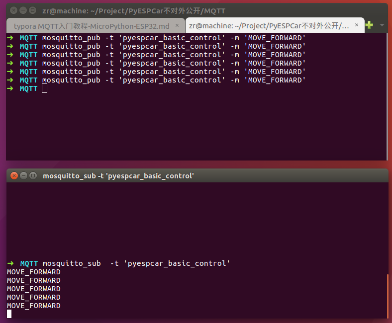
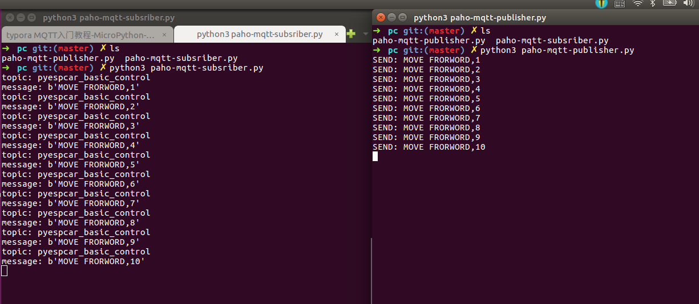

# MQTT入门之项目实战-MicroPython-ESP32-1Z实验室


## 概要
本文主要以Ubuntu与MicroPython-ESP32之间进行MQTT通信为主线，讲解了开发环境配置，库的使用方法。
这篇文章相当于上篇教程**MQTT入门之概念解析-MicroPython-ESP32-1Z实验室**的实战。
最后留了一个小作业，通过MQTT协议，在PC上控制MicroPython-ESP32上面的LED亮灭。


## 推广
**1Z实验室出品**
**1zlab: make things easy** 致力于在机器人+计算机视觉+人工智能的重叠区域, 制作小白友好的教程.


## Mosquitto

### 安装Mosquitto

在Ubuntu上面搭建MQTT的开发环境，可以选择**Mosquitto**, Mosquitto是Eclipse开源的项目， 官网： [mosquitto.org](https://mosquitto.org/)。

其中`mosquitto`就是MQTT Broker的实现， `mosquitto-clients`是MQTT客户端的实现。

```bash
$ sudo apt-get install mosquitto mosquitto-clients 
```


### mosquitto_pub

`-t` 代表指定topic

`-m` 代表message信息

```bash
$ mosquitto_pub -t 'pyespcar_basic_control' -m 'MOVE_FORWARD'
```

在中端上执行上面的这条信息，等于在主题`pyespcar_basic_control` 下发布一条信息`MOVE_FORWARD`

 

### mosquitto_sub

安装成功之后， 你可以通过`mosquitto_sub` 指令， 在中端获取特定Topic的数据。 

```bash
$ mosquitto_sub  -t 'pyespcar_basic_control'
```


### 综合实验

打开终端的两个窗口， 首先开启接收者的服务。

```bash
$ mosquitto_sub  -t 'pyespcar_basic_control'
```

然后尝试在另外一个窗口发送信息：

```bash
$ mosquitto_pub -t 'pyespcar_basic_control' -m 'MOVE_FORWARD'
```





注： 因为Server的默认IP就是`localhost`， IP默认就是`1883`，所以这里不需要指定。 更详细的参数介绍见官方文档：

* [mosquitto_pub/doc](https://mosquitto.org/man/mosquitto_pub-1.html)
* [mosquitto_sub/doc](https://mosquitto.org/man/mosquitto_sub-1.html)


## paho-mqtt

### 安装paho-mqtt

另外我们还希望可以使用Python 进行基于MQTT的物联网开发， 这就需要用使用`pip3`安装另外一个库 **paho-mqtt** ,  官网[https://www.eclipse.org/paho/](https://www.eclipse.org/paho/). 

> The Eclipse Paho project provides open-source client implementations of MQTT and MQTT-SN messaging protocols aimed at new, existing, and emerging applications for the Internet of Things (IoT).


```bash
$ sudo pip3 install paho-mqtt
```


### 使用paho-mqtt实现接收者

`pc/paho-mqtt-subsriber.py`

```python
import paho.mqtt.client as mqtt

def on_message(client, userdata, msg):
    '''处理message回调'''
    print('topic: {}'.format(msg.topic))
    print('message: {}'.format(str(msg.payload)))

# 建立一个MQTT的客户端
client = mqtt.Client()
# 绑定数据接收回调函数
client.on_message = on_message

HOST_IP = 'localhost' # Server的IP地址
HOST_PORT = 1883 # mosquitto 默认打开端口
TOPIC_ID = 'pyespcar_basic_control' # TOPIC的ID

# 连接MQTT服务器
client.connect(HOST_IP, HOST_PORT, 60)
# 订阅主题
client.subscribe(TOPIC_ID)

# 阻塞式， 循环往复，一直处理网络数据，断开重连
client.loop_forever()
```


### 使用paho-mqtt实现发布者

`pc/paho-mqtt-publisher.py`

```python
import paho.mqtt.client as mqtt
import time

HOST_IP = 'localhost' # Server的IP地址
HOST_PORT = 1883 # mosquitto 默认打开端口
TOPIC_ID = 'pyespcar_basic_control' # TOPIC的ID

# 创建一个客户端
client = mqtt.Client()
# 连接到服务器（本机）
client.connect(HOST_IP, HOST_PORT, 60)

count = 0
while True:
    count += 1
    # 待发送的数据
    message = 'MOVE FRORWORD,{}'.format(count)   
    # 通过mqtt协议发布数据给server
    client.publish(TOPIC_ID, message)
    # 打印日志
    print('SEND: {}'.format(message))
    # 延时1s
    time.sleep(1)
```


### 综合实验

可以在本地的终端打开两个串口，分别输入指令:


```bash
# 运行订阅者
$ python3 paho-mqtt-subsriber.py
```

```bash
# 运行发布者
$ python3 paho-mqtt-subsriber.py
```

功能其实跟上文的`Mosquitto`例程差不多。




左边是接收者的进程， 右边是发送者的进程， 这里大家留意一下，接收者在接收的时候数据打印出来是这样的：

```
topic: pyespcar_basic_control
message: b'MOVE FRORWORD,175'
```

这里的`b'MOVE FRORWORD,175'` 是字节bytes类型的数据， 在Http通信的过程中数据以`utf-8` 编码的方式，传递字节数据。

通过`decode`方法， 可以把bytes类型的数据转换为字符串。

```python
In [1]: bdata = b'MOVE FRORWORD,175'
In [2]: bdata.decode('utf-8')
Out[2]: 'MOVE FRORWORD,175'
```


## MQTT与ESP32-MicroPython

之前的历程都是在Ubuntu的本机上测试的， 真正的物联网怎么少的了单片机呢， 我们这里把单片机（MicroPython-ESP32）结合进来。


### 在ESP32上安装MQTT库

首先，我们需要在ESP32上面安装mqtt的库。（MQTT客户端在ESP32上面的实现）


首先确认ESP32-MicroPython已经连接上了热点！！！, 通过REPL控制ESP32。

引入`upip`包管理器

```python
>>> import upip
```

```python
>>> upip.install('micropython-umqtt.simple')
Installing to: /lib/
Installing micropython-umqtt.simple 1.3.4 from https://files.pythonhosted.org/packages/bd/cf/697e3418b2f44222b3e848078b1e33ee76aedca9b6c2430ca1b1aec1ce1d/micropython-umqtt.simple-1.3.4.tar.gz

```

这样umqtt.simple这个包就安装好了。


### 查看Server的IP地址

查看PC当前的IP, 在Ubuntu(作为Server)的命令行里面执行指令：

```bash
$ ifconfig
```


```bash
➜  下载 ifconfig 
enp3s0    Link encap:以太网  硬件地址 5c:f9:dd:49:4b:ad  
          UP BROADCAST MULTICAST  MTU:1500  跃点数:1
          接收数据包:0 错误:0 丢弃:0 过载:0 帧数:0
          发送数据包:0 错误:0 丢弃:0 过载:0 载波:0
          碰撞:0 发送队列长度:1000 
          接收字节:0 (0.0 B)  发送字节:0 (0.0 B)
          中断:16 

lo        Link encap:本地环回  
          inet 地址:127.0.0.1  掩码:255.0.0.0
          inet6 地址: ::1/128 Scope:Host
          UP LOOPBACK RUNNING  MTU:65536  跃点数:1
          接收数据包:256668 错误:0 丢弃:0 过载:0 帧数:0
          发送数据包:256668 错误:0 丢弃:0 过载:0 载波:0
          碰撞:0 发送队列长度:1000 
          接收字节:138568580 (138.5 MB)  发送字节:138568580 (138.5 MB)

wlp2s0    Link encap:以太网  硬件地址 68:5d:43:ec:d3:58  
          inet 地址:192.168.43.16  广播:192.168.43.255  掩码:255.255.255.0
          inet6 地址: fe80::47ef:2ce1:f8e9:b0c2/64 Scope:Link
          UP BROADCAST RUNNING MULTICAST  MTU:1500  跃点数:1
          接收数据包:146459 错误:0 丢弃:0 过载:0 帧数:0
          发送数据包:137348 错误:0 丢弃:0 过载:0 载波:0
          碰撞:0 发送队列长度:1000 
          接收字节:147948142 (147.9 MB)  发送字节:20083083 (20.0 MB)

```

**192.168.43.16** 当前PC在局域网的IP地址为


### 使用umqtt实现接收者

`esp32/subscriber.py`

```python
from umqtt.simple import MQTTClient
import time

SERVER = '192.168.43.16'
CLIENT_ID = 'PYESPCAR_A0'
TOPIC = b'pyespcar_basic_control'

def mqtt_callback(topic, msg):
	print('topic: {}'.format(topic))
	print('msg: {}'.format(msg))


client = MQTTClient(CLIENT_ID, SERVER)
client.set_callback(mqtt_callback)
client.connect()

client.subscribe(TOPIC)


while True:
	# 查看是否有数据传入
	# 有的话就执行 mqtt_callback
	client.check_msg()
	time.sleep(1)
```


### 使用umqtt实现发送者

`esp32/publisher.py`

```python
from umqtt.simple import MQTTClient
import time

SERVER = '192.168.43.16'
CLIENT_ID = 'PYESPCAR_A0' # 客户端的ID
TOPIC = b'pyespcar_basic_control' # TOPIC的ID

client = MQTTClient(CLIENT_ID, SERVER)
client.connect()


while True:
    client.publish(TOPIC, 'helloworld')
    time.sleep(1)
```

注意在Esp32里面`TOPIC`需要是`bytes`类型。 


### 综合实验

你可以结合paho-mqtt里面的发送者与esp32里面的接收者进行测试。

也可以使用paho-mqtt里面的接收者与esp32里面的发送者进行测试。


## 作业

在PC上封装一个库，可以通过MQTT远程控制ESP32上面的LED亮灭。

上文**MQTT入门之概念解析**，已经把程序的整个流程列给你了。


## 深入学习

你可以参照1Z实验室出品的PyESPCar， 里面有监听键盘事件，通过MQTT协议远程控制PyESPCar的源码：
* [src/pc/keyboards_detect.py](https://github.com/1zlab/1ZLAB_PyEspCar/blob/master/src/pc/keyboards_detect.py)
* [src/pc/pyespcar_sdk.py](https://github.com/1zlab/1ZLAB_PyEspCar/blob/master/src/pc/pyespcar_sdk.py)
* [src/esp32/mqtt_control_mode.py](https://github.com/1zlab/1ZLAB_PyEspCar/blob/master/src/esp32/mqtt_control_mode.py)


## Reference

1. [mqtt.github.io](mqtt.github.io)
2. [MQTT协议中文版-Gitbook](https://mcxiaoke.gitbooks.io/mqtt-cn/content/mqtt/01-Introduction.html)
3. [初识 MQTT-IBM](https://www.ibm.com/developerworks/cn/iot/iot-mqtt-why-good-for-iot/index.html)
4. [raspberry-pi-esp32-micropython-mqtt-dht22-tutorial](https://www.rototron.info/raspberry-pi-esp32-micropython-mqtt-dht22-tutorial/)

## 推广
**1Z实验室出品**
**1zlab: make things easy** 致力于在机器人+计算机视觉+人工智能的重叠区域, 制作小白友好的教程.


