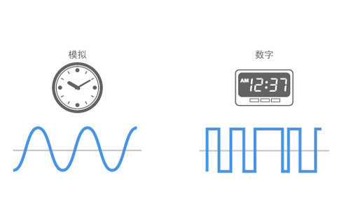

# GPIO控制小灯亮灭-1Z实验室


## 概要

数字信号与GPIO输出控制小灯亮灭。


## 数字信号

在计算机领域，信号分为两种，一种是模拟信号，一种是数字信号。



**模拟信号 Analog **是连续的值，可以取0-N之间任意的值。

**数字信号 Digital** 是离散的值，而且更局限的是它只有**0 （低电平）**跟 **1（高电平）** 两种状态。


> TODO 电压与 0，1 之间的映射
>
> 分割  ？v - ？ v是低电平
>
> 需要查阅手册
>
> TODO  配图


对于单片机的数字引脚而言，只能输出高电平与低电平两种状态，如果用数字信号来控制LED小灯，0跟1可以控制小灯的亮灭两种状态。

| 电平     | 小灯   |
| -------- | ------ |
| 高电平 1 | 小灯亮 |
| 低电平 0 | 小灯灭 |


## Pin.OUT输出

我们在文章[用ESP32-MicroPython点亮一个LED-1Z实验室](https://www.jianshu.com/p/a25bc059ea1c) 中，讲解了如何给MicroPython写入代码，同时也提供了点亮一个LED的演示实例，这里我们再次回顾一下。

> TODO  提供接线图

从`machine`模块里面，导入`Pin` 管脚这个类。

然后创建一个Pin的对象，括号里面传入这个管脚的GPIO编号，这里用的是12号引脚。

需要声明管脚的模式为输出模式`Pin.OUT`.

```python
from machine import Pin
# 创建一个Pin的对象，传入GPIO的编号
led_pin = Pin(12, Pin.OUT)
```

写入高低电平使用`value`函数。

```python
# 小灯亮
led_pin.value(1)
# 小灯灭
led_pin.value(0)
```

如果`value` 里面不传参数，返回的是引脚高低电平的状态。

```python
led_pin.value()
```


> TODO 控制小灯的亮灭 esp32
>
> 与效果视频
>
> 首先定义为输出模式
>
> Pin.OUT
