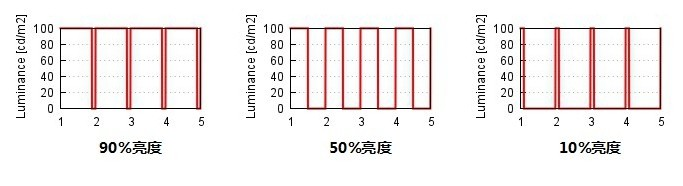

# PWM与呼吸灯-MicroPython-ESP32-1Z实验室


## 概要

* 脉宽调制技术的原理与属性（占空比，频率）
* MicroPython-ESP32 PWM部分的API文档
* 通过PWM脉宽调节技术控制LED的亮度的演示实例。


## PWM脉宽调制技术

**那问题来了，我如何使用数字信号控制小灯的亮度呢？**

其中一种解决方法就是使用PWM技术，PWM的全称为Pulse Width Modulation，翻译成中文是脉宽调节，是把模拟信号调制成脉波的技术。

为了理解这个技术真正鸡贼的地方，我们需要动用我们的想象力。

> 讲解TODO LED闪烁的例子 
>
> TODO 配图 如何可视化

如果控制LED，亮1s，然后灭1s， 往复循环， 那我们可以看到LED在闪烁。如果我们把这个周期缩小到200ms，亮100ms，然后灭100ms，往复循环， 可以看到LED灯在高频闪烁。这个周期持续缩小，持续缩小，总有一个临界值，我们的人眼分辨不出来LED在频闪，而此时LED的亮度处在灭与亮之间亮度的中间值， 达到了1/2亮度。

我们可以调节一个周期内，LED亮与灭的比例， 通过调节比例，就可以达到控制LED亮度的目的。在一个周期内，高电平时间占总体周期的比例，称之为**占空比 （duty）**。



例如PWM的控制周期为100ms，其中20ms为高电平，80ms为低电平，则占空比就是 20/100 = 20%。


注意有时候占空比有时候在嵌入式并不是百分比，而是参考其**分辨率**。有的单片机例如Arduino，它的占空比取值为0-255。

ESP32的duty取值范围为

```
0<= duty <= 1023
```

分辨率越高，也就意味着你可以调节的亮度的档位也就越高，在工作电压0-3.3v之间 划分成1024份，你可以取其任意一个。


PWM的第二个属性就是**频率**， 频率为控制周期T的倒数。在上面这个例子里面，100ms就是控制周期，那频率就是

```
1s / 0.1s = 10HZ
```

频率的取值范围由硬件决定，ESP32的PWM频率范围为`0 < freq <= 78125` 


## PWM-API文档

**PWM可在所有输出引脚上启用。但其存在局限：须全部为同一频率，且仅有8个通道。频率须位于1Hz和78125Hz之间.**
注意是所有引脚哦。

在引脚上使用PWM，您须首先创建一个引脚对象，例如:

```python
>>> from machine import Pin,PWM
>>> p12 = Pin(12,Pin.OUT)
```

使用以下指令创建PWM对象:

```python
# 把Pin对象传入PWM的构造器中
>>> pwm12 = PWM(p12)
# 初始化PWM 频率=500, 占空比=512
>>> pwm12.init(500, 512)
```

或者初始化的时候，一步到位

```python
>>> pwm12 = PWM(p12, freq=500, duty=512)
```


您也可使用以下方法设置频率与占空比:

```python
>>> pwm12.freq(500)
>>> pwm12.duty(512)
```

注意：占空比介于0至1023间，其中512为50%。若您打印PWM对象，则该对象将告知您其当前配置:

```python
>>> pwm12
PWM(12, freq=500, duty=512)
```

您也可调用没有参数的freq()和duty()方法以获取其当前值。


引脚将继续保持在PWM模式，直至您使用以下指令取消此模式:

```python
>>> pwm12.deinit()
```

**注意： pwm使用完了之后，需要销毁，注意`deinit`**

## LED亮度控制效果演示

> TODO 
>
> 添加效果视频
>
> 呼吸灯


```python
import machine
import utime, math

# 初始化一个PWM对象叫做 led_pwm
led_pwm = machine.PWM(machine.Pin(12), freq=1000)

def pulse(led_pwm, delay):
    # 呼吸灯核心代码
    # 借用sin正弦函数，将PWM范围控制在 0 - 1000范围内
    for i in range(20):
        led_pwm.duty(int(math.sin(i / 10 * math.pi) * 500 + 500))
        # 延时delay个ms
        utime.sleep_ms(delay)
try:
    while True:
        pulse(led_pwm, 50)
except:
    # 销毁PWM对象
    led_pwm.deinit()
```


**注意 这里加了一个try except， 如果键盘事件中断之后， pwm资源可以自动释放**


## 参考文献


[经典科普：为什么电影24帧就行，但游戏要60帧？](http://www.igao7.com/news/201510/QMB9FrbTUNLvjpd8.html)

[人类显示器的黑历史](http://www.igao7.com/news/201807/oJMDaPCKHbeufGdI.html)

[定义PWM-upycraft文档](https://dfrobot.gitbooks.io/upycraft_cn/3.2.8%20PWM.html)
